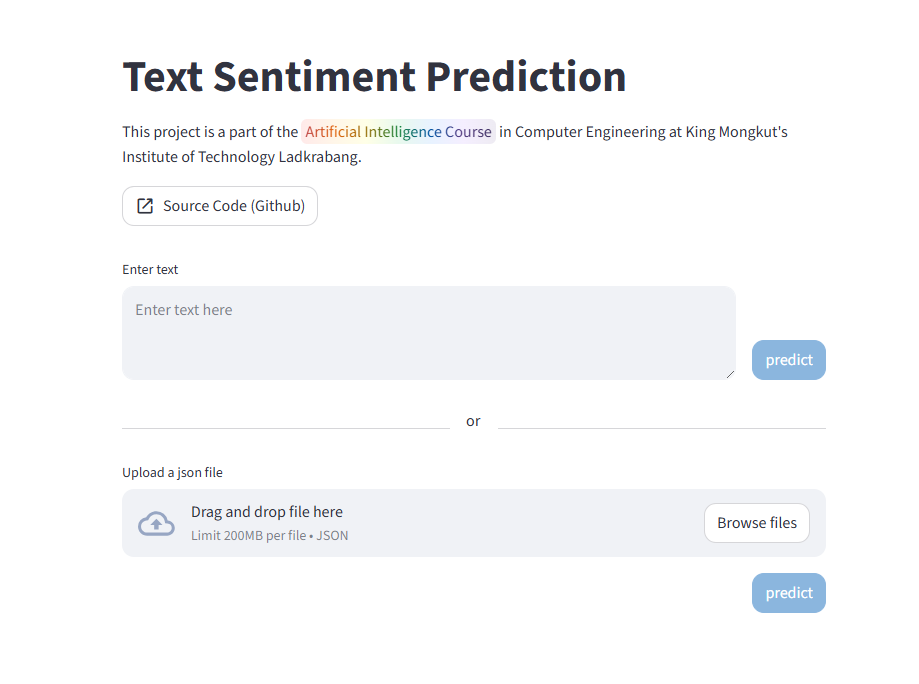

# 🔎 Thai-Sentiment-Analysis
This project uses a model to classify Thai text into different classes. Users can enter a message, and the system will analyze and predict the category automatically.

> Possible results:
😊 Positive
😐 Neutral
😡 Negative

## 🖼️ Demo

 

Live Demo : https://thai-sentiment-analysis.streamlit.app/

## 🔧 Installation

1. Clone the repository 
   ```bash
   git clone https://github.com/MustMark/Thai-Sentiment-Analysis.git
   ```

2. Navigate into the folder
    ```bash
   cd Thai-Sentiment-Analysis
   ```

3. Install dependencies
    ```bash
   pip install -r requirements.txt
   ```

## 🚀 How to Run
1. Start the web
    ```
    streamlit run app.py
    ``` 

2. Open your browser and visit
    ```
    http://localhost:8501
    ```

## 🧑‍💻 How to Use

This web application allows users to predict the sentiment of Thai text using **two methods**.

**1. Predict from Text Input**

- Enter Thai text in the "Enter text" box.
- And then click the Predict button.
- The model will analyze the text and display the sentiment result.

**2. Predict from JSON File**

If the user uploads a JSON file (an example can be found in `dataset/sample_unseen_sentiment.json`), the system will process all text records in the file and predict their sentiment automatically.

> Possible results:
😊 Positive
😐 Neutral
😡 Negative

## 🧪 Model Testing
The model can also be tested directly using the `test_model` (can be found in `models/test.py`)

### Example Usage

```
from models.test import test_model

texts = [
    "ว้าวววววว",
    "ตายกันหมด",
    "มาแล้ว"
]

result = test_model(texts)
print(result)
```

> Example Output
```['positive', 'negative', 'neutral']```

## 🧠 Model

**Model file location :** `models/weights/stack_model.pkl`

**Model Format :** The model is packaged using **joblib (.pkl file)**.